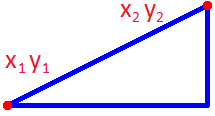

# Вариант 2

## Задача 2.1 (2 балла)

Напишите программу. Программа рисует:

## Задача 2.2 (2 балла)

Напишите функцию **fig(size1, size2)**. Линия до квадрата длиной **size2**. Сторона квадрата размера **size1**, линия до квадрата длиной **size2**

## Задача 1.3 (2 балла)

Даны (x1, y1) левая нижняя и (x2, y2) правая верхняя точка прямоугольного треугольника.

Напишите функцию **fig(x1, y1, x2, y2)**. Она рисует прямоугольный треугольник. 

Рисовать только треугольник. Писать `x1 y1 x2 y2` НЕ надо.

## Задача 1.4 (3 балла)

Написать функцию **uzor(size, n)**. Она рисует узор из n **пар** фигур.

uzor(50, <b>3</b>) нарисует (**3 раза по 2 фигуры**):

**+3 балла, если функция умеет рисовать любое количество фигур**

uzor(50, <b>3</b>) нарисует (**3 фигуры**):

## Задача 1.5 (5 баллов)

Написать функцию **grid(n, m)**. Функция `grid(6, 8)` нарисует:

Подсказка: рисовать линии, а не квадраты.

## Задача 1.6 (2 балла)

Написать функцию **fig3(size1, size2)**

* Функция рисует 2 линии.
* Большая линия синяя, маленькая линия красная.
* **+1 балл**, если линии одинаковые, то обе зеленые.

| fig3(100, 50) | fig3(30, 100) | Дополнительно: fig3(100, 100) |
|----|----|----|
|  |    |  |

